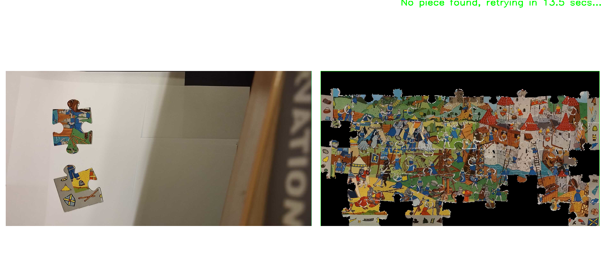

# Automatic Puzzle Solver
This project, part of Ecole Polytechnique's Image Analysis and Computer Vision class, is an automatic puzzle solver. Knowing the completed puzzle image, it helps the user completing the puzzle by showing him where to place the pieces live on screen. 

*Puzzle solver on a 54 large piece puzzle*

## Setup & Installation

Download the **IP Webcam** App on your phone, and use your phone as a camera to film your puzzle pieces (ideally on a white background). Use the IP Webcam url to connect with the computer.  

As a disclaimer, if you are using eduroam, we highly recommend doing a connexion sharing between your phone and your computer, as the wi-fi can cause connection problems. 

## How to run
1) Put your phone on a flat surface to be able to film the puzzle pieces
  
2) In `src` :
- Run `run_test_application` for a live test of the puzzle solving
- Or run `run_test_unique` for a detailed analysis on one frame
